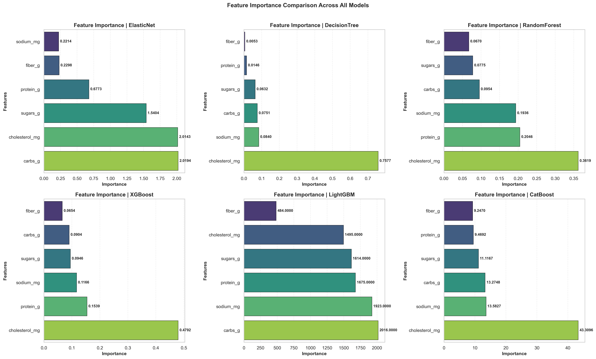
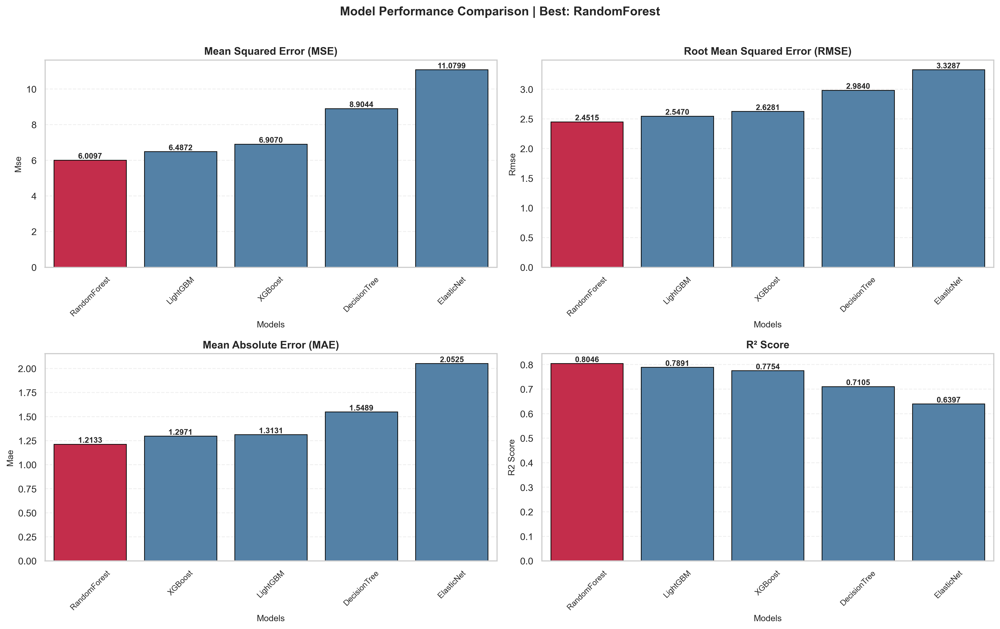
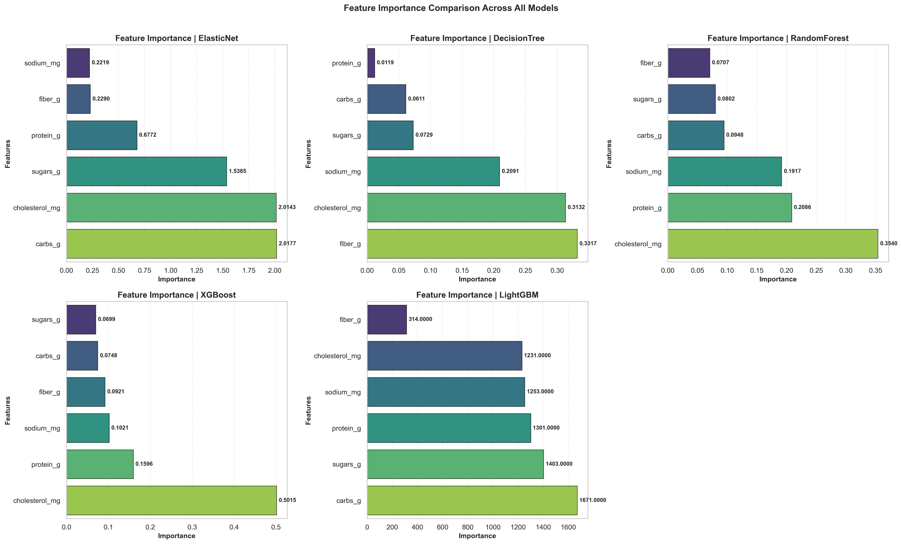

# Python cho khoa học dữ liệu - 23KDL - Nhóm 4
MSSV       | HỌ VÀ TÊN |
---------- | --------- |
23280043   | Phạm Khang Bình
23280051   | Nguyễn Hoàng Anh Duy
23280068   | Nguyễn Hải Lâm

# Fast Food Nutrition Prediction
---
Dự đoán khối lượng chất béo bão hòa trong các món ăn nhanh sử dụng 5 thuật toán học máy khác nhau bao gồm:
- Mô hình dạng hồi quy tuyến tính:
    - ElasticNet
- Mô hình dạng cây:
    - DecisionTree
    - RandomForest
    - XGBoost
    - LightGBM

Sử dụng các độ đo đánh giá mô hình hồi quy phổ biến: MAE, MSE, RMSE, R2-score.

## Mục lục
1. [Giới thiệu](#1-giới-thiệu)
2. [Cấu trúc thư mục](#2-cấu-trúc-thư-mục)
3. [Cài đặt](#3-cài-đặt)
4. [Cách sử dụng (argparse + config)](#4-cách-sử-dụng-argparse--config)
5. [Dataset](#5-dataset)
6. [Kết quả](#6-kết-quả)

## 1. Giới thiệu

**Mục tiêu**: dự đoán khối lượng chất béo bão hòa (saturated fat) của các món ăn nhanh tại những chuỗi cửa hàng lớn, dựa trên các đặc trưng dinh dưỡng cơ bản, dễ dàng tính toán được của từng sản phẩm.

**Điểm đặc biệt**: có thể tái sử dụng cho các bộ dataset khác nhau liên quan tới regression *(cần chỉnh sửa cho phù hợp)*.

---

## 2. Cấu trúc thư mục

```
Python-Cho-KHDL/
├── src/                        # Source code
│   ├── data/                   # Xử lý dữ liệu
│   ├── models/                 # Mô hình học máy
│   ├── utils/                  # Tiện ích
│   └── visualization/          # Trực quan hóa
├── scripts/                    # Scripts chạy chương trình
│   ├── train.py                # Script huấn luyện chính
│   └── experiment.py           # Script thực nghiệm
├── configs/                    # Cấu hình
│   └── default_config.ini      # File cấu hình mặc định
├── data/                       # Dữ liệu (raw/interim/processed)
├── outputs/                    # Kết quả đầu ra
│   ├── logs/                   # Logs huấn luyện
│   ├── models/                 # Models đã lưu (.joblib)
│   ├── plots/                  # Biểu đồ
│   │   └── eda/                # Biểu đồ EDA (before/after)
│   └── results/                # Kết quả đánh giá (.csv, .json)
├── notebooks/                  # Jupyter notebooks
│   ├── eda.ipynb               # Notebook EDA
│   └── model_visualize.ipynb   # Notebook visualization
├── docs/                       # Tài liệu/báo cáo
├── requirements.txt
└── readme.md
```

---

## 3. Cài đặt
### 3.1. Clone repository:
```bash
git clone https://github.com/khangbinhdl/Python-Cho-KHDL.git
cd "Python-Cho-KHDL/"
```
### 3.2. Cài đặt môi trường ảo (khuyến khích)
```bash
# Linux/Mac
python3 -m venv venv
source venv/bin/activate

# Windows
python -m venv venv
venv\Scripts\activate
```
### 3.3. Cài đặt dependencies
```bash
pip install --upgrade pip
pip install -r requirements.txt
```
---

## 4. Cách sử dụng (argparse + config)
### 4.1. Các tham số hỗ trợ

| Tham số | Mô tả | Kiểu | Giá trị hợp lệ |
|---------|-------|------|------------------|
| `--config` | Đường dẫn file cấu hình | str | - |
| `--data` | Đường dẫn file dữ liệu | str | - |
| `--target` | Tên cột target | str | - |
| `--test-size` | Tỷ lệ test set | float | 0.0-1.0 |
| `--random-state` | Random seed | int | - |
| `--models` | Models cần train | str | `all` hoặc danh sách (ElasticNet,RandomForest,LightGBM,XGBoost,DecisionTree) |
| `--optimize` | Bật/tắt optimization | str | `true`, `false`, `1`, `0` |
| `--eda` | Bật/tắt EDA plots | str | `true`, `false`, `1`, `0` |
| `--plot` | Bật/tắt model visualization | str | `true`, `false`, `1`, `0` |
| `--num-strategy` | Xử lý giá trị thiếu (biến số) | str | `drop`, `mean`, `median`, `mode`, `ffill`, `bfill` |
| `--cat-strategy` | Xử lý giá trị thiếu (biến phân loại) | str | `drop`, `mode`, `constant`, `ffill`, `bfill` |
| `--dt-strategy` | Xử lý giá trị thiếu (datetime) | str | `drop`, `ffill`, `bfill` |
| `--scaler` | Phương pháp scaling | str | `standard`, `robust` |
| `--outlier` | Phương pháp phát hiện outliers | str | `iqr`, `zscore`, `isolation_forest` |
| `--encoder` | Phương pháp encoding categorical | str | `onehot`, `label` |
| `--drop-features` | Các features cần loại bỏ | str | Danh sách phân cách bởi dấu phẩy |
| `--clean-negative` | Xử lý giá trị âm | str | `true`, `false`, `1`, `0` |

### 4.2. Một vài ví dụ
Chạy mặc định:
```bash
python scripts/train.py
```

Ghi đè data và target:
```bash
python scripts/train.py --data "data/raw/FastFoodNutritionMenuV3.csv" --target "saturated_fat_g"
```

Bật tối ưu hyperparameters:
```bash
python scripts/train.py --optimize true
```

Chỉ train model cụ thể (bật EDA và plot từ CLI):
```bash
python scripts/train.py --models "RandomForest,LightGBM" --eda true --plot true
```

Tắt EDA và visualization:
```bash
python scripts/train.py --eda false --plot false
```

Chỉnh các phương pháp xử lý dữ liệu:
```bash
python scripts/train.py --num-strategy median --cat-strategy mode --scaler standard --outlier iqr --encoder onehot --clean-negative true
```

Run experiment sweep:
```bash
python scripts/experiment.py
```

---

## 5. Dataset
- Nguồn: [Kaggle - Nutritional Fast Food Dataset](https://www.kaggle.com/datasets/tan5577/nutritonal-fast-food-dataset)
- File: `data/raw/FastFoodNutritionMenuV3.csv`
- Số hàng: 1147
- Số cột: 14

Ý nghĩa các cột được mô tả như sau:

| Cột | Mô tả |
|:----|:-----|
| **Company** | Tên công ty/thương hiệu sản xuất mặt hàng. |
| **Item** | Tên của sản phẩm/món ăn cụ thể. |
| **Calories** | Tổng lượng calo (năng lượng) trong một khẩu phần sản phẩm. |
| **Calories from Fat** | Lượng calo đến từ chất béo trong một khẩu phần. |
| **Total Fat (g)** | Tổng lượng chất béo (gram) trong một khẩu phần. |
| **Saturated Fat (g)** | Lượng chất béo bão hòa (gram) trong một khẩu phần. |
| **Trans Fat (g)** | Lượng chất béo chuyển hóa (trans fat - gram) trong một khẩu phần. |
| **Cholesterol (mg)** | Lượng Cholesterol (miligram) trong một khẩu phần. |
| **Sodium (mg)** | Lượng Natri/Muối (miligram) trong một khẩu phần. |
| **Carbs (g)** | Tổng lượng Carbohydrate (gram) trong một khẩu phần. |
| **Fiber (g)** | Lượng chất xơ (gram) trong một khẩu phần. |
| **Sugars (g)** | Lượng đường (gram) trong một khẩu phần. |
| **Protein (g)** | Lượng Protein (gram) trong một khẩu phần. |
| **Weight Watchers Pnts** | Điểm số theo hệ thống tính điểm của chương trình ăn kiêng Weight Watchers (có thể đã lỗi thời hoặc chỉ áp dụng cho một số thị trường). |

---

## 6. Kết quả

Kết quả chi tiết được lưu trong thư mục `outputs/` bao gồm: 
- Models đã huấn luyện.
- Logs huấn luyện / thực nghiệm.
- Plots EDA và đánh giá mô hình.
- Bảng kết quả đánh giá mô hình / thực nghiệm.

### 6.1. Trước khi tối ưu siêu tham số
Kết quả so sánh hiệu năng các mô hình (với target là `saturated_fat_g`):


Biểu đồ tầm quan trọng đặc trưng của các thuật toán:


### 6.2. Sau khi tối ưu siêu tham số
Kết quả so sánh hiệu năng các mô hình sau khi tối ưu siêu tham số (với target là `saturated_fat_g`):
 
Biểu đồ tầm quan trọng đặc trưng của các thuật toán sau tối ưu siêu tham số:

