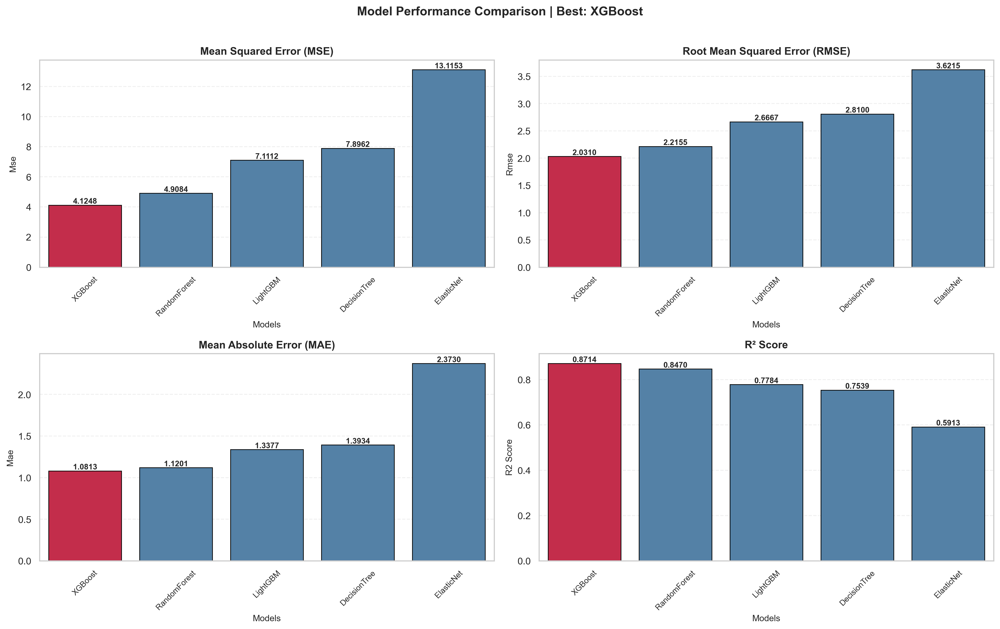
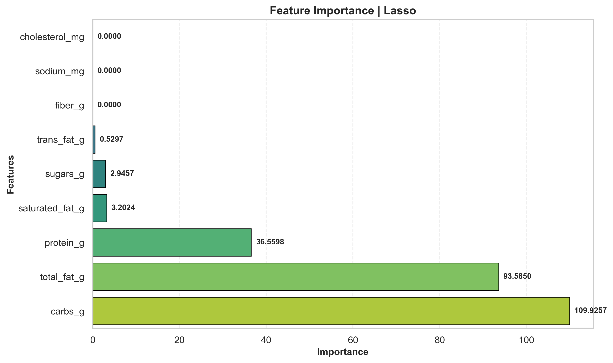

# Fast Food Nutrition Prediction
---
## 1. Giới thiệu

**Mục tiêu**: dự đoán khối lượng chất béo bão hòa (saturated fat) của các món ăn nhanh tại những chuỗi cửa hàng lớn, dựa trên các đặc trưng dinh dưỡng cơ bản, dễ dàng tính toán được của từng sản phẩm.

**Điểm đặc biệt**: có thể tái sử dụng cho các bộ dataset khác nhau liên quan tới regression *(cần chỉnh sửa cho phù hợp)*.

---

## 2. Cấu trúc thư mục

```
Cuối kì/
├── src/                  # Source code
├── scripts/              # train.py, experiment.py
├── configs/              # default_config.ini
├── data/                 # raw/interim/processed
├── outputs/              # logs, models, plots, results
├── docs/                 # report
├── requirements.txt
└── readme.md
```

---

## 3. Cài đặt
### 3.1. Clone repository:
```bash
git clone https://github.com/khangbinhdl/Python-Cho-KHDL.git
cd "Python-Cho-KHDL/Cuối kì"
```
### 3.2. Cài đặt môi trường ảo (optional)
```bash
# Linux/Mac
python3 -m venv venv
source venv/bin/activate

# Windows
python -m venv venv
venv\Scripts\activate
```
### 3.3. Cài đặt dependencies
```bash
pip install --upgrade pip
pip install -r requirements.txt
```
---

## 4. Cách sử dụng (argparse + config)

Chạy mặc định:
```bash
python scripts/train.py
```

Ghi đè data và target:
```bash
python scripts/train.py --data "data/raw/FastFoodNutritionMenuV3.csv" --target "saturated_fat_g"
```

Bật tối ưu hyperparameters:
```bash
python scripts/train.py --optimize
```

Chỉ train model cụ thể (ví dụ bật EDA từ CLI):
```bash
python scripts/train.py --models "RandomForest,LightGBM" --eda
```

Run experiment sweep:
```bash
python scripts/experiment.py
```

Các tham số hỗ trợ:
| Tham số | Mô tả | Kiểu | Mặc định |
|---------|-------|------|----------|
| `--config` | Đường dẫn file config | str | `configs/default_config.ini` |
| `--data` | Đường dẫn file dữ liệu | str | Từ config |
| `--target` | Tên cột target | str | `saturated_fat_g` |
| `--test-size` | Tỷ lệ test set (0.0-1.0) | float | 0.2 |
| `--random-state` | Random seed | int | 42 |
| `--models` | Models cần train | str | `all` |
| `--optimize` | Bật optimization | flag | False |
| `--eda` | Bật EDA plots | flag | True |
| `--drop-features` | Các features cần loại bỏ | str | Từ config |
| `--clean-negative` | Xử lý giá trị âm | bool | True |
| `--categorical-encoding` | Phương pháp encoding | str | `onehot` |
---

Ghi chú: EDA và model plots được bật theo mặc định (điều khiển bởi `configs/default_config.ini` - `VISUALIZATION.enable_eda` và `VISUALIZATION.enable_plots`). Để tắt một trong hai, chỉnh file config hoặc sửa giá trị tương ứng.

## 6. Dataset
- Nguồn: [Kaggle - Nutritional Fast Food Dataset](https://www.kaggle.com/datasets/tan5577/nutritonal-fast-food-dataset)
- File: `data/raw/FastFoodNutritionMenuV3.csv`
- Số hàng: 1147
- Số cột: 14

Ý nghĩa các cột được mô tả như sau:

| Cột | Mô tả |
|:----|:-----|
| **Company** | Tên công ty/thương hiệu sản xuất mặt hàng. |
| **Item** | Tên của sản phẩm/món ăn cụ thể. |
| **Calories** | Tổng lượng calo (năng lượng) trong một khẩu phần sản phẩm. |
| **Calories from Fat** | Lượng calo đến từ chất béo trong một khẩu phần. |
| **Total Fat (g)** | Tổng lượng chất béo (gram) trong một khẩu phần. |
| **Saturated Fat (g)** | Lượng chất béo bão hòa (gram) trong một khẩu phần. |
| **Trans Fat (g)** | Lượng chất béo chuyển hóa (trans fat - gram) trong một khẩu phần. |
| **Cholesterol (mg)** | Lượng Cholesterol (miligram) trong một khẩu phần. |
| **Sodium (mg)** | Lượng Natri/Muối (miligram) trong một khẩu phần. |
| **Carbs (g)** | Tổng lượng Carbohydrate (gram) trong một khẩu phần. |
| **Fiber (g)** | Lượng chất xơ (gram) trong một khẩu phần. |
| **Sugars (g)** | Lượng đường (gram) trong một khẩu phần. |
| **Protein (g)** | Lượng Protein (gram) trong một khẩu phần. |
| **Weight Watchers Pnts** | Điểm số theo hệ thống tính điểm của chương trình ăn kiêng Weight Watchers (có thể đã lỗi thời hoặc chỉ áp dụng cho một số thị trường). |

---

## 7. Models / Phương pháp
Các models được sử dụng:
- ElasticNet.
- RandomForest.
- LightGBM.
- XGBoost.
- DecisionTree.

Các độ đo được sử dụng để đánh giá mô hình: 
- MSE.
- RMSE.
- MAE.
- R2.

---

## 8. Kết quả
Kết quả so sánh hiệu năng các mô hình (với target là `saturated_fat_g`):


Biểu đồ tầm quan trọng các đặc trưng của XGBoost:


Kết quả chi tiết được lưu trong thư mục `outputs/` bao gồm: 
- Models đã huấn luyện.
- Logs huấn luyện / thực nghiệm.
- Plots EDA và đánh giá mô hình.
- Bảng kết quả đánh giá mô hình / thực nghiệm.